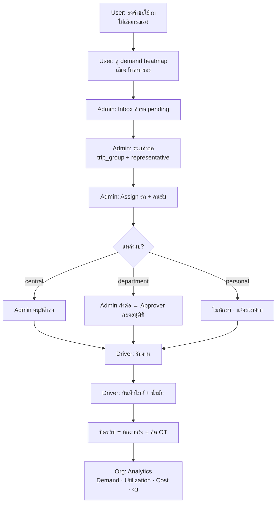

# Vehicle Module — Product Spec

> **สร้าง:** 2026-06-20 · เอกสารหลักการผลิตภัณฑ์ของระบบยานพาหนะ
> อ่านก่อนออกแบบ/แก้ feature ใดๆ ในโดเมน vehicle เพื่อกัน scope drift
> Schema/route detail → [schema.md](database/schema.md) · [INDEX_routes.md](INDEX_routes.md) · [INDEX_code.md](INDEX_code.md)

---

## 1. หลักการแกน (North Star)

ระบบนี้คือ **"ระบบบริหารทรัพยากรยานพาหนะ"** ที่มีช่องทางให้ผู้ใช้ส่งคำขอเข้ามา

**ไม่ใช่** ระบบจองรถแบบ self-service (เลือกวัน เลือกรถ ยืนยันเอง)

เป้าหมายหลัก = เพิ่มประสิทธิภาพการใช้ทรัพยากรการเดินทาง + เก็บข้อมูล**ความต้องการ**ใช้รถเพื่อวางแผนระยะยาว ไม่ใช่แค่ทำให้จองสำเร็จ

> **กฎทอง:** ข้อมูล**ความต้องการใช้รถ (demand)** สำคัญกว่าข้อมูล**รถว่าง (availability)** — ทุกการออกแบบต้องไม่ทำลายข้อมูล demand

---

## 2. บทบาท + เป้าหมาย

### User
1. ส่งคำขอใช้รถ
2. ดูว่าวันใดมีการใช้รถน้อย/มาก (เพื่อเลือกวันที่อนุมัติง่ายขึ้น)
3. ดูรายละเอียดการเดินทางของแต่ละวัน
4. เพิ่มโอกาสได้รับอนุมัติ

> User **ไม่เลือก**ประเภทรถ/คันที่ต้องการ — การจัดสรรเป็นหน้าที่ Admin

### Admin
1. อนุมัติคำขอ
2. **รวม**คำขอที่เส้นทาง/วัตถุประสงค์ใกล้กันเป็นทริปเดียว
3. จัดสรรคนขับ
4. จัดสรรรถ
5. บริหารงบการเดินทาง
6. ติดตามน้ำมัน
7. จัดการ OT คนขับ
8. สร้างรายงานวางแผนประจำปี

### Approver (ผู้อนุมัติงบกอง)
หน้าที่: **อนุมัติการใช้งบของคำขอที่เป็นงานของกองตนเอง** (เช่น กองวิชาการ — งาน "ขอรถรับส่งอาจารย์")
- ผูกกอง↔ผู้อนุมัติผ่าน `DeptApprover` (1 user รับผิดชอบได้หลายกอง)
- อนุมัติ = ผูกคำขอกับ **งบกอง (`department`) ที่ถูกจัดสรร** + guard ว่ามีงบ active พอ
- เห็นเฉพาะคำขอของกองตนเอง (`approver_inbox()`)
- **เงินหักจริงตอนปิดทริป** (mileage) ไม่ใช่ตอน approve — ดู §4/§9

### องค์กร (analytics goals)
- สถิติการใช้รถ (แยกตามแผนก/หมวดงบ — ดู §6 ข้อจำกัด)
- อัตราการใช้งานรถแต่ละคัน
- ภาระงานคนขับ
- ค่าน้ำมัน / ค่า OT
- ประเมินความต้องการรถ + งบในอนาคต

---

## 3. ข้อจำกัด UX (ห้ามละเมิด)

1. **ห้าม** ออกแบบให้กลายเป็น self-service booking
2. ผู้ใช้ทุกคน**ต้องส่งคำขอ**เข้าระบบก่อนเสมอ
3. Admin เป็นผู้ตัดสินใจจัดสรรรถ / รวมงาน / บริหารทรัพยากร
4. ระบบต้อง**รักษาข้อมูลทั้งหมด**ไว้เพื่อวิเคราะห์ (รวมคำขอที่ถูกปฏิเสธ/ยกเลิก/รวมเข้าทริปอื่น)

---

## 4. โมเดลข้อมูล — Demand vs Execution (สำคัญที่สุด)

`vehicle_booking` 1 row = **1 คำขอ (request)** เสมอ แม้ภายหลังถูกรวมเดินทางคันเดียวกัน

การรวมทริปใช้ **representative pattern**:
- คำขอที่ถูกรวม share `trip_group` (Integer) เดียวกัน
- รถ/คนขับ/ไมล์/น้ำมัน/OT ผูกที่ **row แรก (representative / trip leader)** เท่านั้น
- ไม่มี Trip table แยก — `trip_group` เป็น group key

### 2 มุมมองที่ทุก query/รายงานต้องแยกให้ชัด

| มุมมอง | นับอะไร | ตอบเป้าหมาย |
|---|---|---|
| **Demand** | **ทุก** booking row — รวม merged + rejected + cancelled | ประเมินรถ/งบอนาคต · heatmap วันไหนใช้มาก · สถิติคำขอ |
| **Execution** | เฉพาะ **representative** row (`assigned_vehicle_id IS NOT NULL` หรือ trip leader) | utilization รถ · ภาระคนขับ · ค่าน้ำมัน/OT จริง |

> ❌ ห้ามนับ execution metric จากทุก row (จะ double-count คำขอที่ merge)
> ❌ ห้ามนับ demand จากเฉพาะ representative (จะพลาด demand จริงที่ถูกรวม/ปฏิเสธ)

---

## 5. กฎรักษาความถูกต้องของ representative

representative pattern เปราะตรงที่ data จริงผูกหัวทริปไว้ row เดียว — กฎกัน:

1. **Cancel leader → un-merge อัตโนมัติ** (implemented 2026-06-20): `cancel_booking()` reset สมาชิกที่เหลือใน trip_group กลับเป็น `pending` + เคลียร์ `assigned_vehicle_id`/`driver_id`/`trip_group` ให้ admin จัดใหม่ (ไม่ลากไป cancelled ตามทั้งกลุ่ม); สมาชิกที่ **หักงบแล้ว** (`budget_deducted_at`) จะถูก skip + flash เตือน admin (กัน ledger เพี้ยน). แก้ dead-end เดิมที่ leader cancel แล้วทริปเสียหัวเงียบ
2. คำขอที่ถูกรวม (non-leader) ยังคงสถานะ "คำขอ" ของตัวเอง — ไม่ลบ ไม่กลืน
3. demand query ต้องไม่กรอง merged/rejected ออกโดยไม่ตั้งใจ

---

## 6. ข้อจำกัดที่ยอมรับแล้ว (accepted limitations)

| ข้อจำกัด | ผล | ทางแก้อนาคต (ถ้าต้องการ) |
|---|---|---|
| `purpose` เป็น free text | สถิติ "แยกประเภทงาน" ทำได้แค่ระดับ **แผนก/หมวดงบ** (`trip_department`/`central_category`) ไม่ใช่ประเภทงานจริง (รับ-ส่งผู้ป่วย/ประชุม/ขนของ) | เพิ่ม lookup `job_type` + FK บน booking — ไม่กระทบ schema เดิม |
| ไม่มี Trip table | data ระดับทริปกระจายที่ leader row | สร้าง Trip entity (migration ใหญ่) — ทำเมื่อ representative pattern เริ่มเป็นคอขวดจริง |

---

## 7. Feature ที่ยังขาด (อยู่บน demand view)

> ตรวจก่อนสร้าง ว่ายังไม่มีใน [INDEX_routes.md](INDEX_routes.md)

1. **Demand heatmap** (user goal 2) — ปฏิทินแสดงวันที่ใช้รถมาก/น้อย จากการนับคำขอต่อวัน → ช่วย user เลือกวันที่อนุมัติง่าย (≠ ปฏิทินรถว่าง ซึ่งเป็น booking mindset ที่ห้าม)
2. **รายงานวางแผนปี** (admin goal 8) — สรุป demand + utilization + cost รายเดือน/ปี เพื่อประเมินรถ+งบอนาคต

---

## 8. Anti-patterns (สัญญาณว่าหลงทิศ)

- มีหน้าให้ user เลือกรถ/ยืนยันการจองเอง → ผิดหลักการ §1
- ลบ/ซ่อนคำขอที่ rejected/merged ออกจาก DB → ทำลาย demand data §3.4
- รายงาน utilization ที่นับทุก booking row → double-count §4
- แสดง "รถว่าง" เป็น primary view แทน "คำขอ" → กลับหัว priority §1

---

## 9. UX Flow

### 4 เฟส + จุด UX ที่บังคับหลักการ

**Phase 1 — User (capture demand)**
- form ถาม intent: วัน·เวลา·ปลายทาง·จุดประสงค์·จำนวนคน — **ไม่มี dropdown เลือกรถ/ประเภทรถ**
- `demand heatmap` แทน "ปฏิทินรถว่าง" — เห็นวันคนเยอะ/น้อยเพื่อเลี่ยง (ไม่ใช่เห็นรถว่างแล้วจอง — anti-pattern §8)
- ทุก submit = 1 row `pending` เสมอ

**Phase 2 — Admin (allocate)**
- inbox = คิวคำขอ ไม่ใช่ปฏิทินรถ
- **รวมคำขอ** = จุดเกิด representative pattern (§4): คำขอแรก = leader ถือรถ/คนขับ; คำขอที่ถูกรวมยังอยู่เป็น row ตัวเอง
- **Admin assign รถ+คนขับก่อนเสมอ** แล้วจึงเข้าขั้นอนุมัติ

**Phase 3 — อนุมัติ (แยกตามแหล่งงบ)**
| แหล่งงบ | ใครอนุมัติ | กลไก |
|---|---|---|
| `central` (งบกลาง) | Admin เอง | `approve_booking()` |
| `department` (งบกอง) | **Admin กดส่งต่อ** → Approver ของกอง | `waiting_approver` → `approver_inbox()` |
| `personal` | ไม่หักงบ | แจ้งร่วมจ่าย (`notify_payment_required`) |
- ทุก path: อนุมัติ = **guard ว่ามีงบ active พอ** ไม่ใช่หักเงิน

**Phase 4 — Driver (execute + capture cost)**
- รับงาน → ไมล์ออก/เข้า + น้ำมัน → ปิดทริป = **หักงบจริง** (จากงบกลาง/กองตามประเภท) + คิด OT
- cost/ไมล์ ผูกที่ **leader row** เท่านั้น → ป้อน execution metric (§4)

### จุดเสี่ยง UX ที่ต้องกัน
- ปุ่ม "ยกเลิก" บน leader row → cancel แล้ว un-merge อัตโนมัติ (members → pending, §5 #1 implemented 2026-06-20); user ยกเลิกได้เฉพาะ `pending` ก่อน admin จัดรถ — หลังจัดแล้วต้องผ่าน admin
- งานกอง: ถ้า Admin ลืมส่งต่อ → คำขอค้าง ไม่เข้า approver inbox

---

## 10. Gap ที่ปิดแล้ว (improvement plan 2026-06-20)

ref: [doc/2026-06-20_vehicle-improvement-plan.md](doc/2026-06-20_vehicle-improvement-plan.md)

| # | Gap (dead-end เดิม) | ทางแก้ |
|---|---|---|
| A1 | conflict/capacity เช็คแค่ frontend pre-check ไม่ enforce ตอน mutate | server-side guard ผ่าน `check_vehicle_conflict`/`check_driver_conflict` ใน `admin_assign`/`admin_merge`/`admin_swap_vehicle` (block 400 ถ้าทับช่วงเวลา) |
| A2 | งบหักเกินเพดานเงียบ (remaining ติดลบ admin ไม่รู้) | `deduct_budget_for_trip` หลังหัก ถ้า `remaining < 0` → logger.warning + flash เตือน (ไม่บล็อก — ตามกฎ deduct ไม่ block) |
| A3 | ทริปกรอกไมล์ออกแล้วไม่ปิด (odo_start มี odo_end ว่าง) ค้างถาวร | `_auto_close_stale_trips` — กรอกไมล์ออกงานถัดไปของรถคันเดิม → เอา odo ใหม่เป็น odo_end ปิดทริปค้างล่าสุด 1 ตัว + หักงบ + gen OT อัตโนมัติ |
| A4 | leader cancel → ทริปเสียหัวเงียบ | un-merge อัตโนมัติ (§5 #1) |
| A5 | OT ใช้งบกลางไม่จัดสรร admin ไม่รู้งานไหนเยอะ + personal OT ลืมเรียกเก็บ | หน้า cost: section "OT แยกตามประเภทงาน" (`_build_ot_by_expense`) + flag personal uncollected (`_personal_uncollected`) — **เก็บข้อมูลก่อน ยังไม่ auto-charge** |
